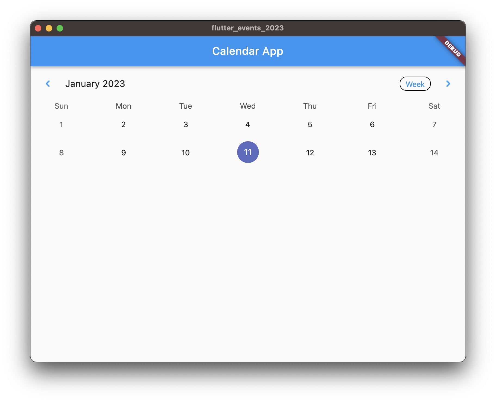
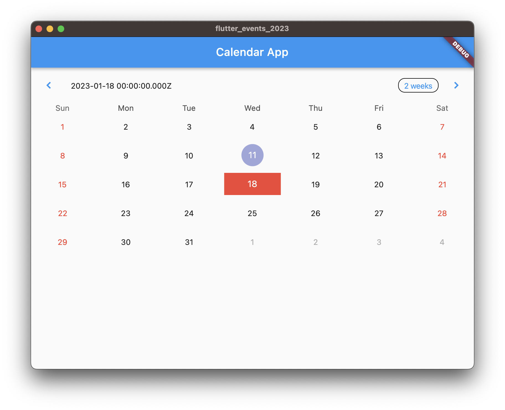
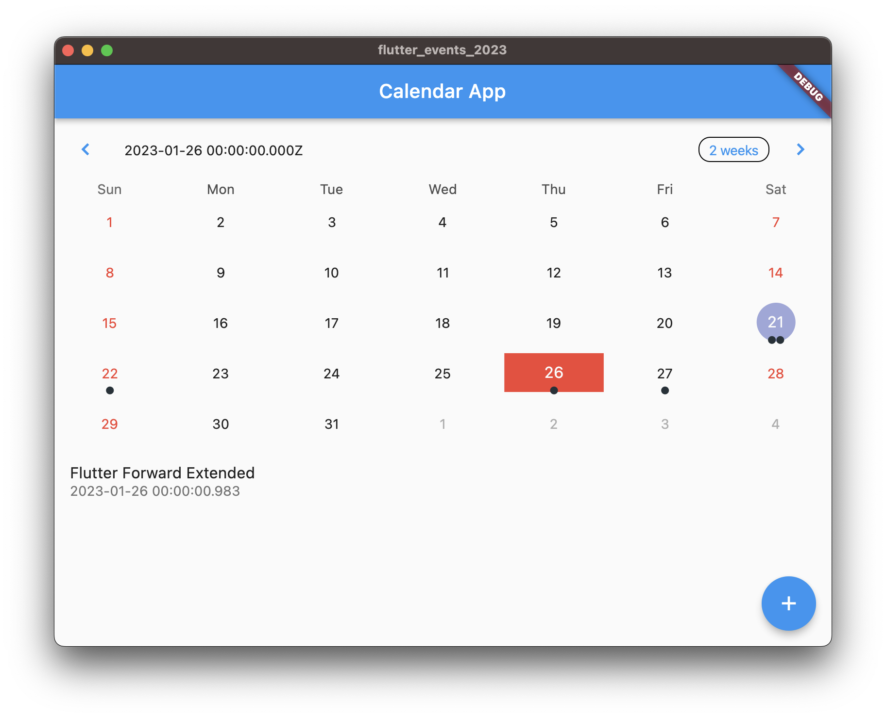
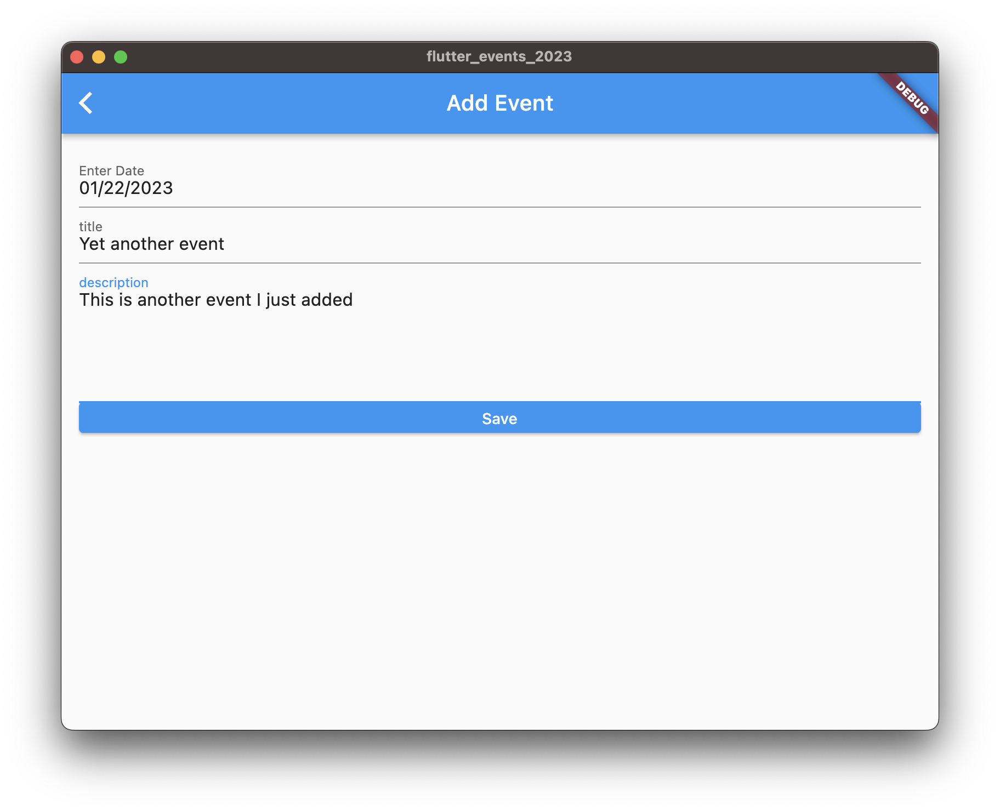

# Calendar App Tutorial

Flutter Calendar App tutorial

## Tutorials

- [Part 1: Calendar and Customization](https://www.appwriters.dev/blog/2023-01-15-flutter-calendar-part-1)
- [Part 2: Loading Events from Firestore](https://www.appwriters.dev/blog/2023-01-19-flutter-calendar-part-2)
- [Part 3: Optimizing Query and Adding Events](https://www.appwriters.dev/blog/2023-01-22-flutter-calendar-part-3)

## Source Code

- [Part 1](https://github.com/lohanidamodar/flutter_events_2023/tree/p1-calendar)
- [Part 2](https://github.com/lohanidamodar/flutter_events_2023/tree/p2-firestore-events)
- [Part 3](https://github.com/lohanidamodar/flutter_events_2023/tree/p3-optimization-and-more)
- [Final with Cleanup and CRUD features](https://github.com/lohanidamodar/flutter_events_2023)

## Screenshots

## Getting Started

This project is a starting point for a Flutter application.

A few resources to get you started if this is your first Flutter project:

- [Lab: Write your first Flutter app](https://docs.flutter.dev/get-started/codelab)
- [Cookbook: Useful Flutter samples](https://docs.flutter.dev/cookbook)

For help getting started with Flutter development, view the
[online documentation](https://docs.flutter.dev/), which offers tutorials,
samples, guidance on mobile development, and a full API reference.
